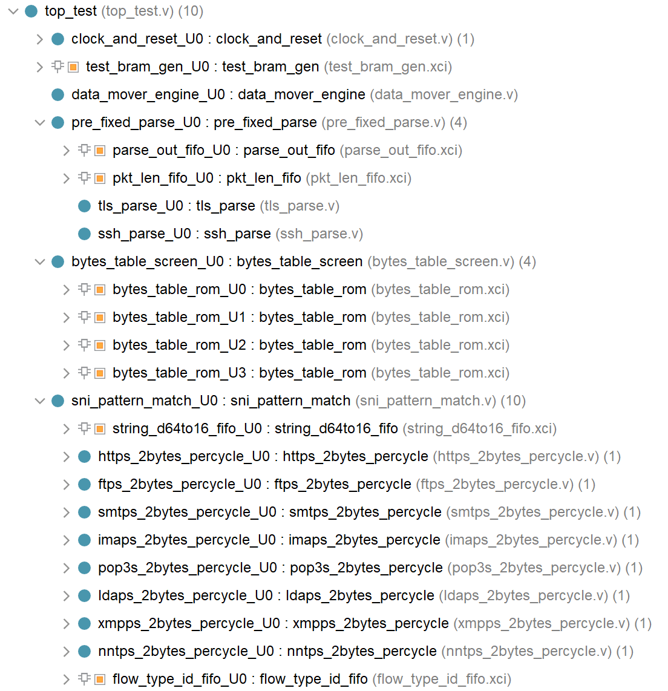
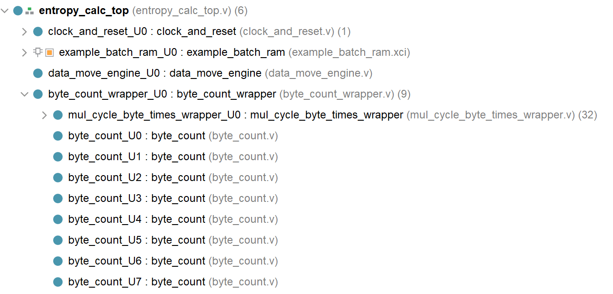
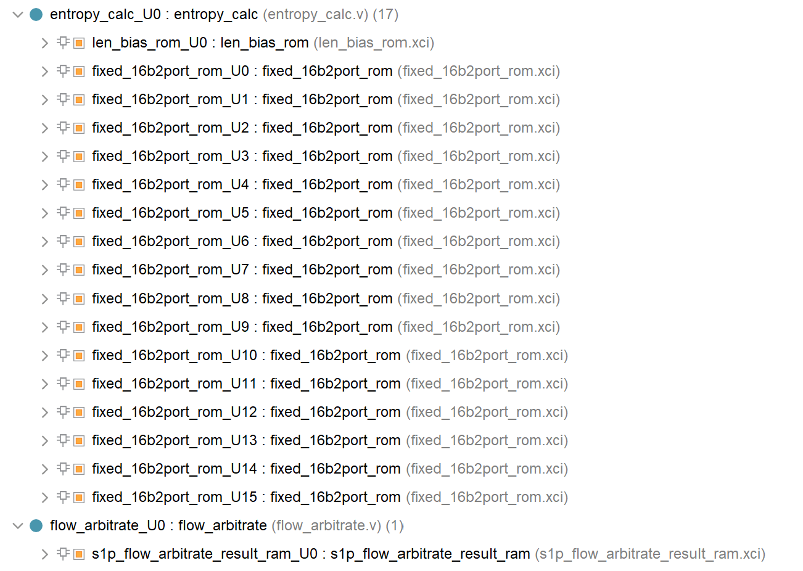

# 基于FPGA的未知加密流量识别

​**简介**​：  
本项目旨在使用FPGA对加密流量识别方法进行加速，以提高未知加密流量识别的实时性，使用的开发板为AXKU5P，芯片型号为xcku5pffvb676-2-i，软件版本为Vivado2018.3。主要涉及的方法基于模式匹配和信息熵计算。

---

## 一、基于FPGA的模式匹配算法加速
### 核心优化  
1. 在单字符串`shift-or`算法基础上优化  
2. ​**双字符串并行匹配**​：采用组合逻辑实现单周期双字符串匹配  
3. ​**通配符支持**​：针对SNI字段特征增加通配功能（忽略中间字段）  
4. ​**快速扫描机制**​：使用模式串前两字节预过滤输入流，避免全窗口匹配  

### 文件结构
​**主文件名**​：`Sni_pattern_match`  
#### 📁 src（RTL代码-Verilog）  
- `data_mover_engine`：BRAM数据读取与传输控制  
- `pre_fixed_parse`：固定字段协议解析（基于TLS/DTLS/SSH协议）
- `bytes_table_screen`：双字节快速扫描（基于待匹配模式串） 
- `sni_pattern_match`：浮动窗口模式匹配（基于改进版shift-or）  
#### 📁 coe  
- 算法掩码表（shift-or专用）  
- 预存模式串前两字节的匹配索引  
### 整体模块结构图

### FPGA资源利用表

| ​**资源类型**​ | ​**使用量**​ | ​**可用量**​ | ​**利用率 (%)​**​ |
|-------------|-----------|-----------|--------------|
| ​**LUT**​     | 916       | 216,960   | 0.42         |
| ​**LUTRAM**​  | 92        | 99,840    | 0.09         |
| ​**FF**​      | 1,078     | 433,920   | 0.25         |
| ​**BRAM**​    | 123       | 480       | 25.63        |
| ​**IO**​      | 19        | 280       | 6.79         |
| ​**BUFG**​    | 1         | 256       | 0.39         |
| ​**MMCM**​    | 1         | 4         | 25.00        |
---

## 二、基于FPGA的信息熵计算加速
### 核心优化  
1. ​**并行字节统计**​：利用FPGA并行架构实时统计256种字节值频率  
2. ​**固定长度处理**​：标准化输入为256字节数据块  
3. ​**查表优化**​：  
   - 预计算并存储`-p*log(p)`的定点数值  
   - 引入长度相关误差补偿机制（牺牲小部分精度换取计算效率）  

### 文件结构
​**主文件名**​：`Entropy_Calc`  
#### 📁 src（RTL代码-Verilog）  
- `data_move_engine`：BRAM数据读取与传输控制  
- `byte_count`：字节值频率并行统计模块  
- `entropy_calc`：查表法熵值计算（含误差补偿）  
- `flow_arbitrate`：流加密属性判定（连续5包加密检测）  
#### 📁 coe  
- `-p*log(p)`定点数查找表（LUT）  
- 长度标准化引入的误差补偿参数
### 整体模块结构图

### FPGA资源利用表

| ​**资源类型**​ | ​**使用量**​ | ​**可用量**​ | ​**利用率 (%)​**​ |
|-------------|-----------|-----------|--------------|
| ​**LUT**​     | 43,668    | 216,960   | 20.13        |
| ​**LUTRAM**​  | 8         | 99,840    | 0.01         |
| ​**FF**​      | 39,624    | 433,920   | 9.13         |
| ​**BRAM**​    | 123.5     | 480       | 25.73        |
| ​**IO**​      | 3         | 280       | 1.07         |
| ​**BUFG**​    | 10        | 256       | 3.91         |
| ​**MMCM**​    | 1         | 4         | 25.00        |
